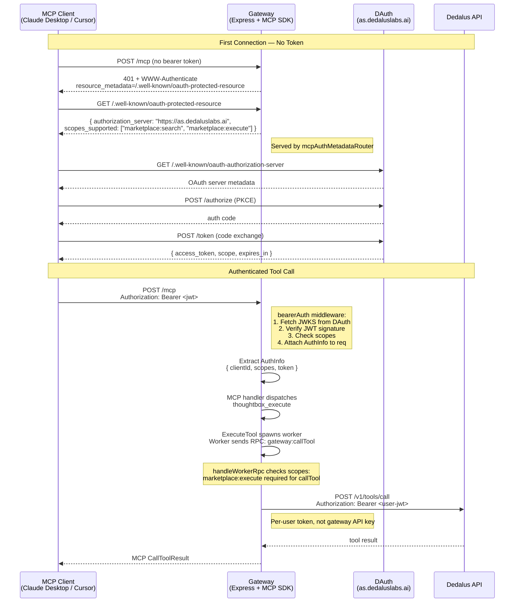
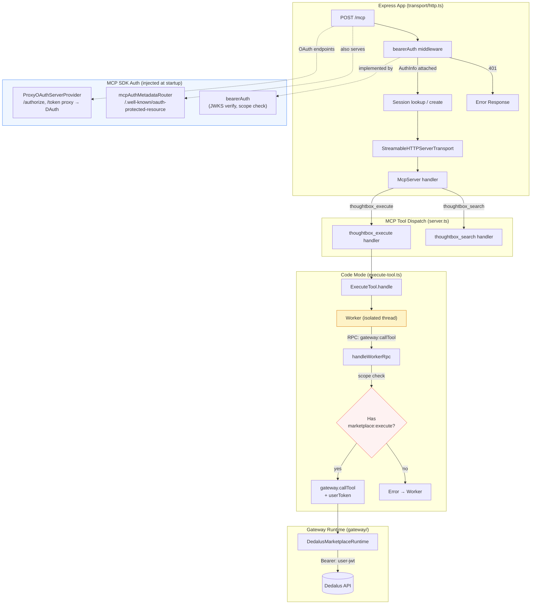
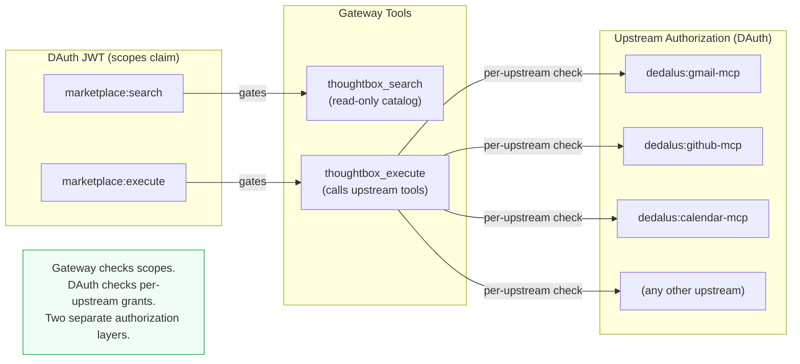
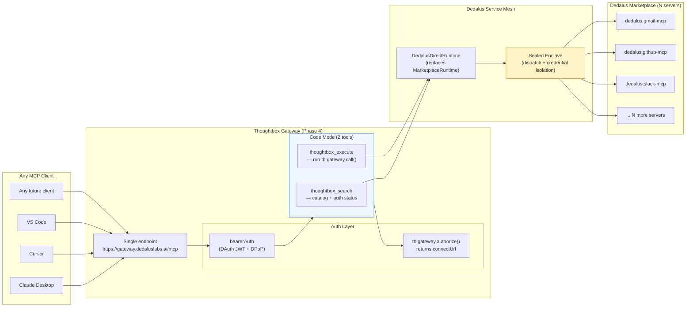
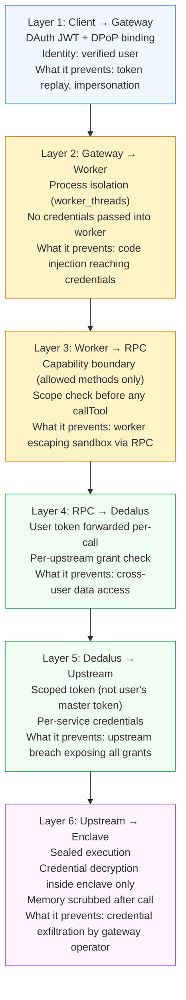
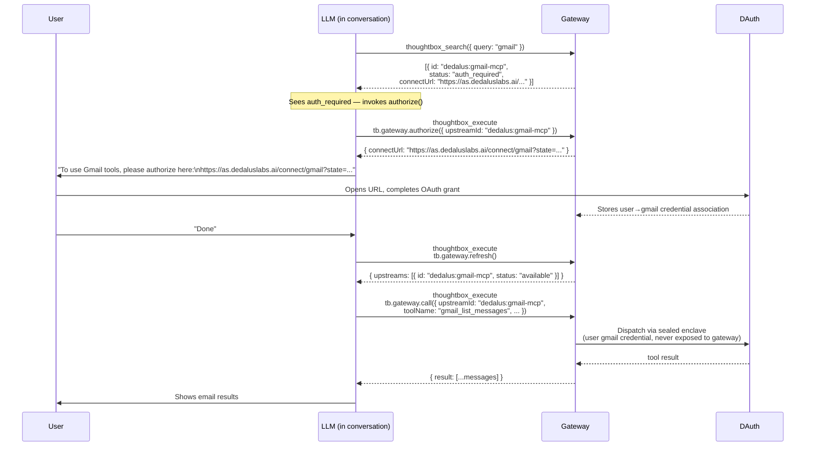

# DAuth Phases 3 & 4 — Architecture

Phase 3 adds multi-user DAuth token validation to the existing single-tenant gateway, threading
per-user credentials through the worker/RPC boundary into Dedalus API calls. Phase 4 replaces
the chat-completions proxy with direct MCP connections over Dedalus's service mesh and introduces
sealed-enclave dispatch, personalized catalogs, and agent-native authorization management.

## Key Files

| File | Current Role | Phase 3 Changes |
|------|-------------|-----------------|
| `src/transport/http.ts` | Express app, session map, `/mcp` POST | Add `mcpAuthMetadataRouter`, `bearerAuth` middleware |
| `src/server.ts` | `ThoughtboxServer` init, gateway wiring | Receive `AuthInfo` per request, pass `userToken` down |
| `src/gateway/types.ts` | `GatewayRuntime` interface | No change to interface; impls receive `userToken` |
| `src/code-mode/execute-tool.ts` | Worker spawn, RPC dispatch | Add `userToken?: string` to `ExecuteToolDeps` |
| `src/gateway/dedalus-marketplace.ts` | Calls Dedalus chat completions API | Replace static API key with per-request user token |

---

## Diagram 1 — Phase 3: Multi-User Auth Flow

The complete path from an unauthenticated MCP client connecting for the first time through DAuth
OAuth, to validated tool calls with per-user token forwarding. The MCP SDK's auth stack handles
RFC 9728 discovery and token validation so the gateway does not implement OAuth itself.

### Invariants

- The user token never enters the worker sandbox. It travels: `bearerAuth → AuthInfo → ExecuteToolDeps.userToken → handleWorkerRpc → gateway.callTool()`. The worker only sees RPC method names and arguments.
- If `marketplace:execute` scope is absent, `handleWorkerRpc` returns an error before calling `gateway.callTool()`. The worker never learns why.
- JWKS verification uses `jose` (already a transitive dep). The gateway caches the key set; it does not make a JWKS request on every tool call.

---

## Diagram 2 — Phase 3: Component Architecture

How the auth middleware layers onto the existing Express app and how the user token threads through
each processing stage without entering the sandboxed worker.

### Design notes

The worker is intentionally isolated (yellow). It executes untrusted LLM-generated JavaScript and
communicates only via structured RPC messages — it cannot read `ExecuteToolDeps.userToken` directly.
The RPC handler in the host process performs all scope checks and all credential-bearing calls.

---

## Diagram 3 — Phase 3: Scope Model

Two gateway-level scopes gate the two Code Mode tools. Per-upstream authorization (e.g., user
granting Gmail access) is handled by DAuth, not by these gateway scopes.

---

## Diagram 4 — Phase 4: System Context

The Universal MCP Endpoint vision: any standards-compliant MCP client connects to one URL and
reaches the entire Dedalus marketplace through two Code Mode tools, without learning the Dedalus SDK.

### What this replaces

Phases 1-3 route every tool call through the Dedalus chat completions API — an LLM intermediary.
Phase 4 introduces `DedalusDirectRuntime`, which sends MCP `callTool` messages directly over the
service mesh. The LLM is no longer in the execution path; it only generates the JavaScript that
the worker runs.

---

## Diagram 5 — Phase 4: Six-Layer Security Model

Each layer establishes a distinct trust boundary. Compromise of any single layer does not yield
credentials from deeper layers because credentials are not present — they are forwarded through
opaque dispatch or held in the sealed enclave.

### What Dedalus must build for Layer 6

The sealed enclave dispatch requires three new platform capabilities:
1. MCP-aware dispatch (forward MCP protocol messages, not raw HTTP)
2. Per-user credential storage keyed to DAuth identity (encrypted at rest)
3. Memory scrub after each tool call returns

Layers 1-5 are built in the gateway; Layer 6 is a Dedalus platform responsibility.

---

## Diagram 6 — Phase 4: Agent-Native Auth Flow

When an LLM discovers that an upstream requires authorization, it can manage the entire OAuth flow
within the conversation without human intervention beyond visiting the authorization URL. This is the
`tb.gateway.authorize()` flow added in Phase 4.

### Notes

- `tb.gateway.authorize()` is a new RPC method added to `handleWorkerRpc` in Phase 4. It exists
  so the LLM can request a connect URL without leaving the execute flow.
- `tb.gateway.refresh()` re-fetches the catalog so `status: "auth_required"` entries update to
  `status: "available"` after the user completes OAuth.
- The gateway never sees the upstream credential — it tells the enclave to dispatch on the user's
  behalf. The enclave decrypts, calls, and scrubs.

---

## Diagram 7 — Phase 3 to Phase 4 Evolution

A side-by-side comparison of the architectural changes. Green nodes are shared between phases;
yellow nodes are removed in Phase 4; blue nodes are introduced in Phase 4.

```mermaid
flowchart TD
    subgraph P3["Phase 3 (current target)"]
        P3C[MCP Client] --> P3GW[Gateway\nbearerAuth + mcpAuthMetadataRouter]
        P3GW --> P3ET[ExecuteTool\nworker sandbox]
        P3ET --> P3RPC[handleWorkerRpc\nscope check]
        P3RPC --> P3DMR["DedalusMarketplaceRuntime\n(chat completions proxy)"]
        P3DMR -->|Bearer: user-jwt| P3LLM["Dedalus LLM\n(chat completions API)"]
        P3LLM --> P3UP[Upstream MCP Server]

        style P3DMR fill:#fef3c7,stroke:#d97706
        style P3LLM fill:#fef3c7,stroke:#d97706
    end

    subgraph P4["Phase 4 (universal endpoint)"]
        P4C[Any MCP Client] --> P4GW[Gateway\nbearerAuth + DPoP]
        P4GW --> P4ET[ExecuteTool\nworker sandbox]
        P4ET --> P4RPC["handleWorkerRpc\nscope check + authorize()"]
        P4RPC --> P4DDR["DedalusDirectRuntime\n(service mesh, direct MCP)"]
        P4DDR --> P4ENC["Sealed Enclave\n(credential isolation)"]
        P4ENC --> P4UP[Upstream MCP Server]
        P4GW --> P4CAT["Personalized Catalog\n(auth_required / available)"]

        style P4DDR fill:#dbeafe,stroke:#3b82f6
        style P4ENC fill:#dbeafe,stroke:#3b82f6
        style P4CAT fill:#dbeafe,stroke:#3b82f6
    end

    subgraph Changes["What Changes"]
        direction LR
        RM["Removed:\nDedalusMarketplaceRuntime\nDedalus chat completions call\nLLM in execution path"]
        ADD["Added:\nDedalusDirectRuntime\nSealed enclave dispatch\nPersonalized catalog\ntb.gateway.authorize()\nDPoP binding"]
        KEEP["Unchanged:\nbearerAuth middleware\nworker sandbox\nRPC capability boundary\nscope model\nMCP SDK auth stack"]

        style RM fill:#fef2f2,stroke:#ef4444
        style ADD fill:#f0fdf4,stroke:#16a34a
        style KEEP fill:#f8fafc,stroke:#94a3b8
    end
```

### Migration path

Phase 3 is a self-contained deliverable. The `GatewayRuntime` interface (`src/gateway/types.ts`)
does not change — `DedalusDirectRuntime` implements the same interface as `DedalusMarketplaceRuntime`.
Phase 4 swaps the runtime implementation and adds the enclave dispatch plumbing on the Dedalus
platform side. The gateway's auth stack, worker sandbox, and RPC boundary carry forward unchanged.
